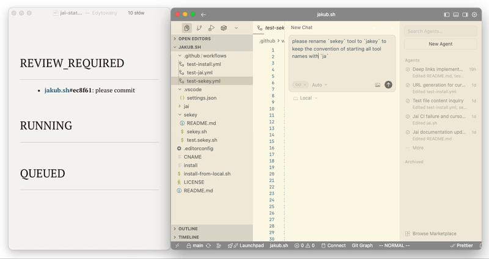
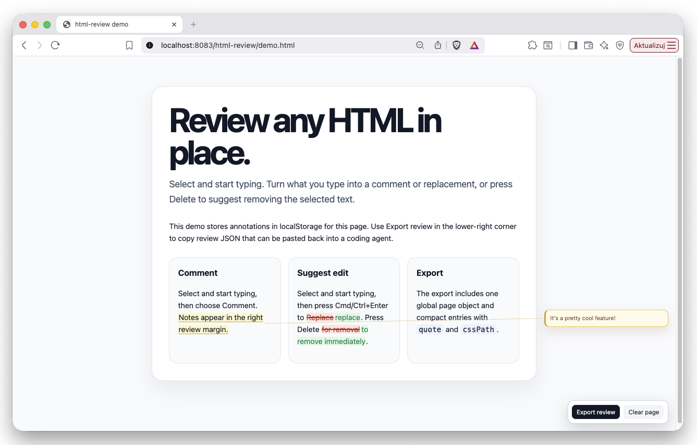

# jakub.sh

A collection of utility tools for modern development workflows.

```bash
curl -fsSL https://jakub.sh/install | bash
```

Or if you want just some of the tools:

```bash
curl -fsSL https://jakub.sh/install | bash -s tool1,tool2
```

Installs all tools into `~/.local/bin`.

## jai

Allows to track progress of tasks/agents from multiple Cursor IDE windows and CLI sessions. `jai` supports both Cursor hooks and generic Zsh hooks, and manages a single Markdown document with current progress.

```bash
jai cursorhooks
jai zshhooks
jai install-cursorhooks [directory]
```

Note Cursor Hooks will replace your existing ones. And if you don't provide the `directory` parameter, it will use the global one.

To see the status simply open the `~/.local/jai-status.md` file in any tool that supports live-reloading from disk (like Typora, Obsidian, Cursor). Or just do `jai watch` to have it the terminal.



⇨ jai / [README.md](jai/README.md)

## sekey

Secure environment variable manager with automatic output sanitization.


Store a secret in macOS Keychain or Linux Secret Service. The script provides a masked prompt.

```bash
sekey set MY_SECRET
```

Sandbox the secret. The command is executed with env injected from secrets, and the output of the command is sanitized.

```bash
sekey --env MY_SECRET command.sh
```
⇨ sekey / [README.md](sekey/README.md)

## html-review

Standalone browser script for adding Word-style comments and suggested edits to any HTML page. It stores review state in localStorage per page and exports structured JSON for sending feedback back to a coding agent.



```html
<script src="https://jakub.sh/html-review/html-review.js"></script>
```

Not installed by `install`; use it directly from GitHub Pages.

⇨ html-review / [README.md](html-review/README.md) / [demo](html-review/demo.html)

